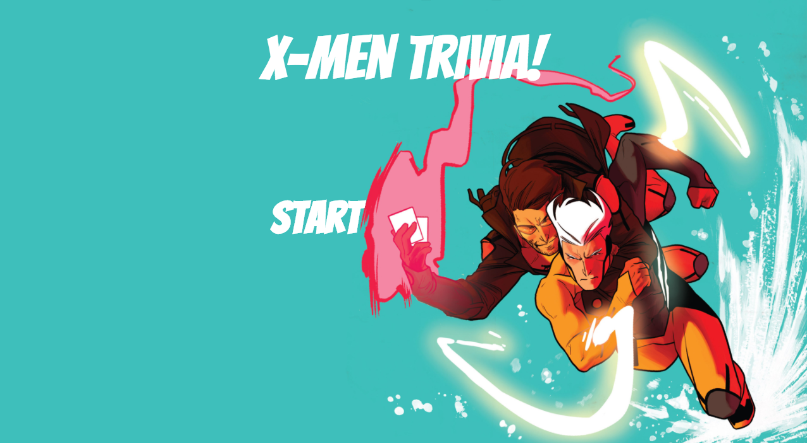

# TriviaGame

A front-end application that uses JavaScript and Jquery to manipulate HTLM and create a timed Trivia quiz. The theme for this application is X-men. 

## Built With
- HTML
- CSS
- Bootstrap
- Javascript
- Jquery

## Game
There is a set of questions prepared to display on the screen once the start button is clicked. Users have 35 seconds to answer as many questions correctly before the timer runs out. If the they are able to complete the quiz before the timer runs out, they can press submit, otherwise once the time runs out the game itself will submit it for them. Then, the number of questions answered correctly, incorrectly and left unanswered are revealed, and the timer stops (if it did not run out). 

## Preview

